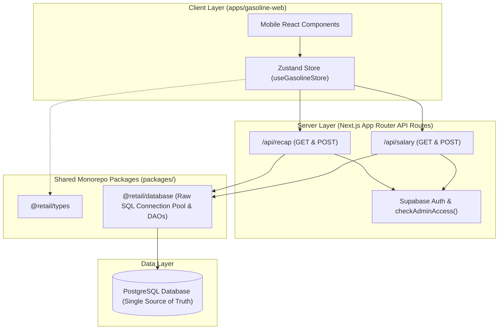

# System Architecture Document: Gasoline Web

## 1. System Overview

**Gasoline Web** is a mobile-first web application designed for retail gasoline operators to manage daily stock opname, track margin calculations, record salary payments, and reconcile daily cash flows.

The application follows a **Database-First Architecture**, where the PostgreSQL cloud database serves as the single source of truth for all operational data.

---

## 2. Monorepo & Directory Architecture

Organized inside an **Nx Monorepo** using **npm workspaces**:

```text
apps/gasoline-web/
├── public/                    # Assets & PWA manifest
├── src/
│   ├── app/                   # Next.js App Router & API Route Handlers
│   │   ├── layout.tsx         # Mobile container shell layout
│   │   ├── page.tsx           # Dashboard / Daily Summary View
│   │   ├── shift/             # Opening & Closing Shift Forms
│   │   ├── stock/             # Stock management & Jerigen tracking
│   │   ├── finance/           # Cash flow summary & reconciliation
│   │   ├── salary/            # Employee salary management
│   │   ├── report/            # Weekly & monthly aggregated reports
│   │   └── api/
│   │       ├── recap/         # GET & POST (sync) recaps to PostgreSQL
│   │       └── salary/        # GET & POST employee salary records
│   ├── components/            # Mobile-optimized UI components
│   │   ├── common/            # MobileLayout, BottomNav, Header
│   │   ├── dashboard/         # Financial summary cards
│   │   ├── daily/             # Shift opname forms
│   │   └── finance/           # Cash flow & salary inputs
│   ├── lib/                   # Pure calculation utilities & Zod schemas
│   │   ├── calculations.ts    # Revenue, capital, profit formulas
│   │   ├── CurrencyFormatter.ts # Short cash & Indonesian float formatters
│   │   └── schemas/           # Form validation schemas
│   └── store/                 # Centralized Zustand state management (Direct DB)
└── docs/                      # Architectural & system documentation
```

---

## 3. Core Architecture & Data Flow



---

## 4. Headless API & Database Schema

### Database Schema Specification (`packages/database/migrations/*.sql`)

```sql
-- Daily Recaps Table
CREATE TABLE gasoline_recaps (
    id UUID PRIMARY KEY DEFAULT gen_random_uuid(),
    date VARCHAR(10) UNIQUE NOT NULL,
    total_sold_liters DOUBLE PRECISION NOT NULL DEFAULT 0,
    total_revenue DOUBLE PRECISION NOT NULL DEFAULT 0,
    total_capital DOUBLE PRECISION NOT NULL DEFAULT 0,
    total_net_profit DOUBLE PRECISION NOT NULL DEFAULT 0,
    cash_in DOUBLE PRECISION NOT NULL DEFAULT 0,
    cash_out DOUBLE PRECISION NOT NULL DEFAULT 0,
    net_finance_flow DOUBLE PRECISION NOT NULL DEFAULT 0,
    uang_awal DOUBLE PRECISION NOT NULL DEFAULT 0,
    belanja DOUBLE PRECISION NOT NULL DEFAULT 0,
    note TEXT,
    created_at TIMESTAMPTZ DEFAULT NOW(),
    updated_at TIMESTAMPTZ DEFAULT NOW()
);

-- Product Items Recaps Table
CREATE TABLE gasoline_product_recaps (
    id UUID PRIMARY KEY DEFAULT gen_random_uuid(),
    recap_id UUID NOT NULL REFERENCES gasoline_recaps(id) ON DELETE CASCADE,
    product_id VARCHAR(50) NOT NULL,
    opening_stock DOUBLE PRECISION NOT NULL DEFAULT 0,
    closing_stock DOUBLE PRECISION NOT NULL DEFAULT 0,
    sold_qty DOUBLE PRECISION NOT NULL DEFAULT 0,
    revenue DOUBLE PRECISION NOT NULL DEFAULT 0,
    capital DOUBLE PRECISION NOT NULL DEFAULT 0,
    profit DOUBLE PRECISION NOT NULL DEFAULT 0
);

-- Employee Salary Payments Table
CREATE TABLE salary_payments (
    id UUID PRIMARY KEY DEFAULT gen_random_uuid(),
    date VARCHAR(10) NOT NULL,
    week_label VARCHAR(100),
    amount DOUBLE PRECISION NOT NULL DEFAULT 0,
    recipient VARCHAR(100),
    note TEXT,
    created_at TIMESTAMPTZ DEFAULT NOW(),
    updated_at TIMESTAMPTZ DEFAULT NOW()
);
```

---

## 5. Architectural Principles

1. **Single Source of Truth**: All operational state is read from and written to PostgreSQL directly. No `localStorage` persistence or client-side offline merging to prevent data conflicts.
2. **Type Safety & Validation**: All incoming requests are validated using Zod schemas (`lib/schemas/`) and mapped through centralized `@retail/types`.
3. **Secure Data Access**: Parameterized Raw SQL queries in `@retail/database` prevent SQL injection attacks. Admin access is enforced server-side via Supabase Auth + database role check (`checkAdminAccess()`).
